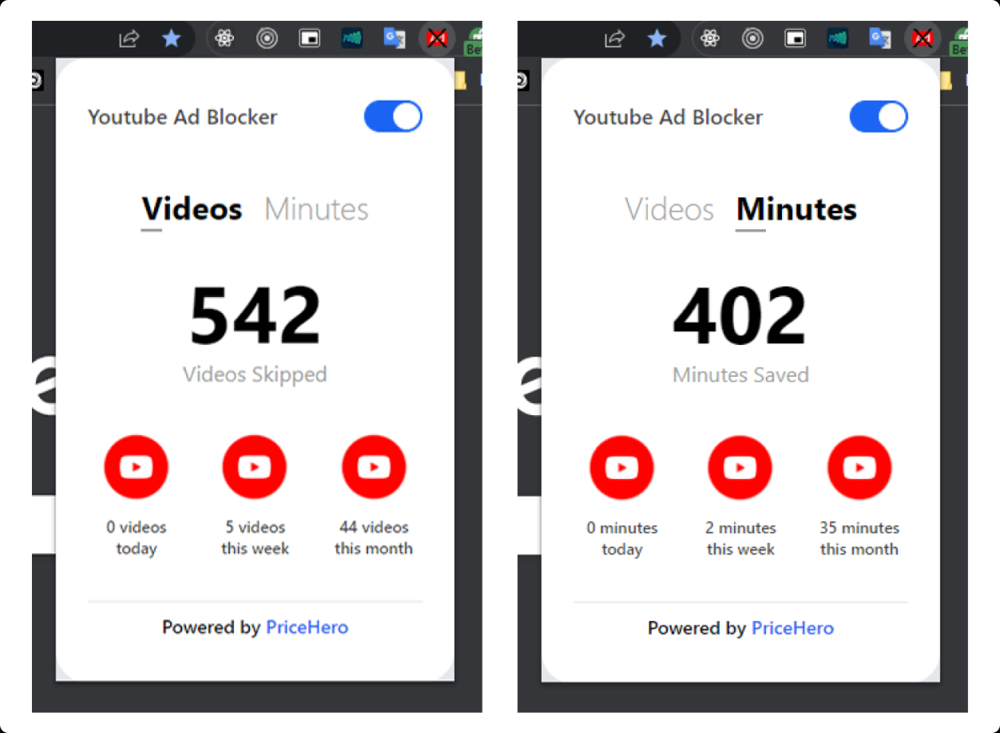
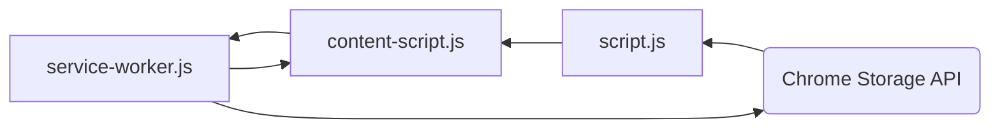

# YoutubeAdBlocker

Preview:




To skip the video ad, run this JS code:

```js
const video = document.getElementsByClassName("video-stream")[0];
const skipButton = document.getElementsByClassName("ytp-ad-skip-button")[0];
video.currentTime = video.duration;
skipButton.click();
```

This line of code is sufficient for skipping the 5s-must-watch type of ads:

```js
document.getElementsByClassName("ytp-ad-skip-button")[0].click();
```

The rest of the block is for skipping the unskippable ads..
We will know soon enough once they appear. 🎉

The extension skips the main ad automatically now and hides all type of ads. ✅

## Notes

There are three scripts and here is the utility of each one of them:

`script.js`

- contains the popup's logic
- gets data that are shown in the popup from the local storage
- it notifies all Youtube tabs when the extension is enabled/disabled

`service-worker.js`

- always running in the background
  - either active or inactive
  - no activity for ≈10 seconds turns it into inactive mode
  - when a message is received it becomes active again
- listens for messages from the content-script.js
- has access to the extension's local storage and updates it when a message is received
- as soon as a message is received, the event listeners you create run their callback functions

`content-script.js`

- injected in the Youtube website
- blocks all types of ads
  - skips the 5s-must-be-watched ads
  - removes all ads that are displayed
- sends messages (that contain the duration of a skipped ad each time) to the content-script
- shows an alert informing asking for page reload when the popup's toggle switch is turned on/off



And there are 6 types of ads:

- Type 1: appears in the homepage
- Type 2: appears on top of the suggested list of videos
- Type 3: appears under the description
- Type 4: skippable 5-second-must-be-watched video ad that appears at the beginning of the video, in the middle or at end
- Type 5: similar to type 4 but 2 video ads appear in row and not only one
- Type 6: unskippable 10-second-must-be-watched video ad

**NB:**

- All data are saved in the local storage and that makes it a standalone app.
- The manifest is of version 3 that can be deployed to the Chrome Web Store without any editing.
- Code is formatted using Prettier default style guides.
- The components are taken from Flowbite UI that is based on Tailwind CSS.

## Todos

None left.
