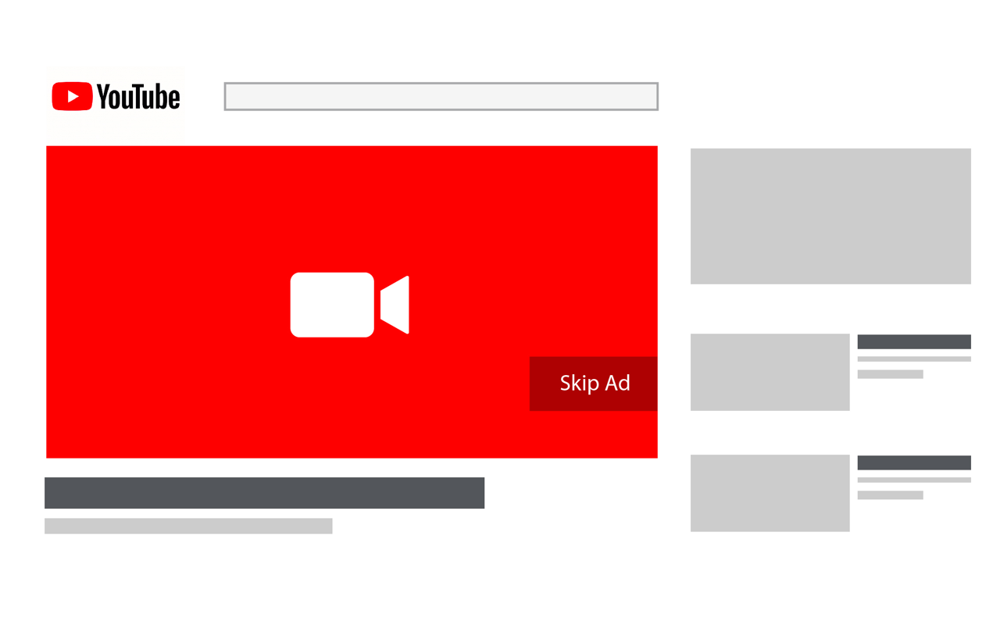
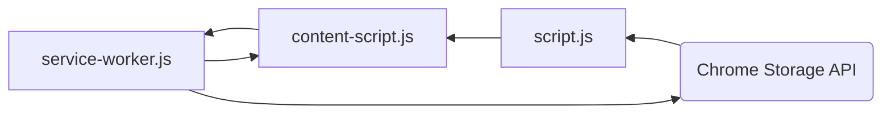
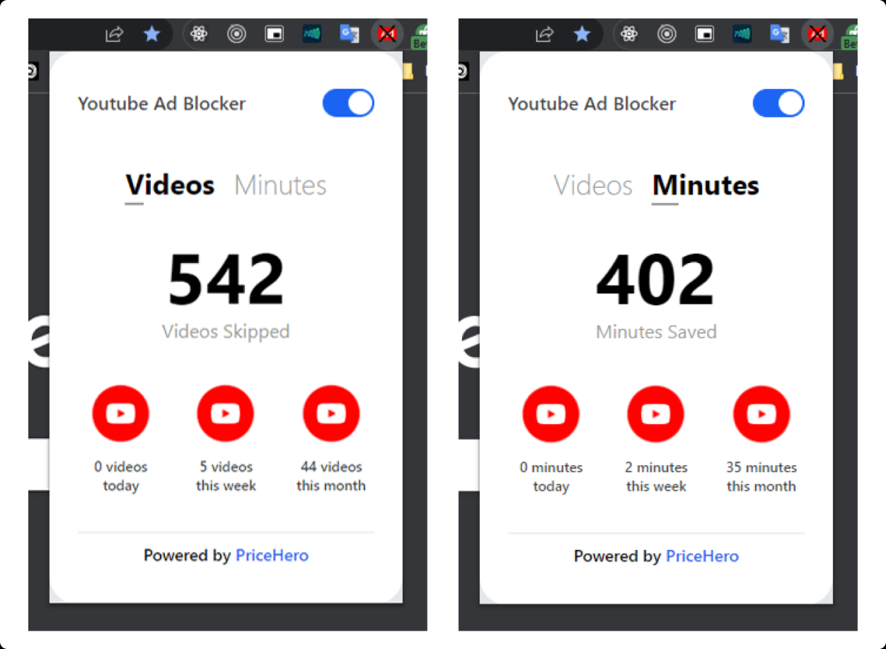

# Youtube Ad Blocker

## Overview

Extension for Chromium-based broswers that skips video ads and hides other 5+ types of banner ads on YouTube, as well as displays statistics for what was skipped (number and duration per past day, month and the total).



## Notes

### Base

To skip a video ad:

```js
const video = document.getElementsByClassName("video-stream")[0];
video.currentTime = video.duration;
document.getElementsByClassName("ytp-ad-skip-button")[0].click();
```

The last line of code might be sufficient for the "5s must-watch" ads.

### Scripts

There are three scripts and here is the utility of each one:

1. `script.js`

   - Contains the popup's logic.
   - Retrieves data displayed in the popup from local storage.
   - Notifies all YouTube tabs when the extension is enabled/disabled.

2. `service-worker.js`

   - Always running in the background;
     - Either active or inactive, with inactivity for approximately 10 seconds resulting in an inactive state.
     - Becomes active again upon receiving a message.
   - Listens for messages from `content-script.js`.
   - Has access to the extension's local storage and updates it when a message is received.
   - Runs event listeners callback functions immediately upon receiving a message.

3. `content-script.js`
   - Injected into the YouTube website.
   - Blocks all types of ads;
     - Skips must-be-watched ads.
     - Hides banner ads.
   - Sends messages containing the details of skipped ads to `content script.js`.
   - Displays an alert, prompting for a page reload, when the popup's toggle switch is turned on/off.



### Types of Ads

1. Appears on the homepage.
2. Appears on top of the suggested list of videos.
3. Appears under the video description.
4. Skippable 5-second-must-be-watched video ad at the beginning, middle, or end of a video.
5. Similar to Type 4, but with two consecutive video ads.
6. Unskippable 10-second-must-be-watched video ad.

And more discovered when using a VPN across multiple countries.

### Additional Details

- All data are saved in local storage, making it a standalone app.
- The manifest is version 3 and can be deployed to the Chrome Web Store without any code updates.
- Code is formatted using Prettier default style guides.
- Flowbite UI components, based on Tailwind CSS, are used.

## Todos

- Address extension issues with video ads to make it work with the latest YouTube updates.

## Extension Preview


